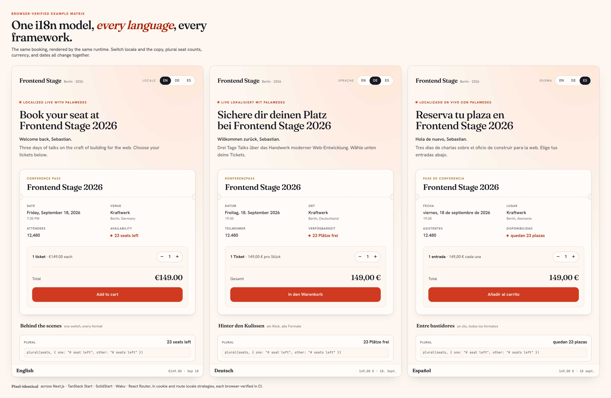

# Palamedes

[](https://github.com/sebastian-software/palamedes/actions/workflows/ci.yml)
[](https://github.com/sebastian-software/palamedes/blob/main/package.json)
[](https://oss.sebastian-software.com/)
[](https://github.com/sebastian-software/palamedes/blob/main/LICENSE)

**Website: [palamedes.dev](https://palamedes.dev)**

Palamedes is i18n tooling for JavaScript and TypeScript teams that want one
translation model to survive framework changes.

You write messages close to the code, keep source-string-first `.po` catalogs,
and use the same runtime model across Next.js, TanStack Start, SolidStart,
Waku, React Router, Vite, and backend servers.

We are not asking you to trust a slogan. The repo shows the work.



The current proof:

- Five framework families, each with cookie, route, subdomain, and tld locale strategies, are
  browser-verified through the same Playwright-based flow used in CI.
- The image above is one demo in three locales: switch language and the copy,
  plural seat counts, currency, and dates all change together. Every framework
  and strategy renders the same design, so per-framework captures live in
  [docs/example-screenshots](docs/example-screenshots) instead of repeating the
  same picture here. All of it is versioned browser output, not a mockup.
- Sixteen ADRs explain the runtime model, message identity, native boundary,
  adapter architecture, and the work deliberately kept out of scope.
- Benchmark commands, fixtures, and machine-readable reports are checked in so
  the numbers can be rerun locally. The checked end-to-end extract/update
  workflow report measures Palamedes at `33.53 ms` on the small profile and
  `42.92 ms` on the medium profile; the Lingui and i18next-parser comparison
  numbers and recorded tool versions are documented in
  [End-to-end workflow benchmark](https://github.com/sebastian-software/palamedes/blob/main/docs/benchmark-e2e-workflow.md).

**Try it live.** The live reference covers cookie, route, subdomain, and tld demos across the framework matrix. Open [Next.js (cookie)](https://nextjs-cookie.examples.palamedes.dev) and [SolidStart (route)](https://solidstart-route.examples.palamedes.dev), switch language, and watch copy, plural seat counts, currency, and dates change together. The full URL list and hosting notes live in [examples/README](examples/README.md).

Under the hood, a Rust core, OXC-powered transforms, and `ferrocat` catalog
semantics handle the careful work: parsing, extraction, updates, audits,
diagnostics, and runtime artifact compilation. PO remains the default catalog
storage, and teams can opt into FCL when they want canonical, merge-friendly
generated catalogs with cleaner machine-owned metadata.

## Why Teams Pick Palamedes

- One i18n mental model across modern frameworks
- Familiar macro-style authoring without carrying older compatibility paths forward
- Fast transforms, extraction, catalog updates, audits, and compile steps
- Source-string-first catalogs that translators can inspect and teams can trust
- Semantic PO/FCL catalog merging for Git merge-driver workflows
- A local foundation for future managed translation workflows without giving up repo ownership

## What Makes It Feel Better

Most i18n stacks eventually ask teams to choose between convenience, speed, and
clarity.

Palamedes is built around a calmer default:

- write the message where the UI happens
- identify messages by `message + context`
- access the active runtime through `getI18n()`
- keep catalog and ICU semantics in one dedicated engine
- let framework adapters stay small

In daily work, that means a translation workflow that is easier to explain,
easier to review, and easier to carry from one framework to the next.

## Current Status

- Recommended for new projects and teams that want cleaner i18n foundations
- Verified today across Next.js, TanStack Start, SolidStart, Waku, and React Router on Node.js `>=22.22`
- Source-string-first catalogs are stable and powered by `ferrocat`, including structured audits and ICU authoring diagnostics
- Placeholder top-level packages exist, but there is no `palamedes` or `create-palamedes` first-run entry yet
- 1.0 stability tiers and public API expectations are documented in [Stability and versioning](https://github.com/sebastian-software/palamedes/blob/main/docs/stability.md)

## What Exists Today

- A browser-verified example matrix across five framework families
- Versioned screenshots generated from the same Playwright-based verifier used in CI
- Reproducible benchmark commands for transform, extract, catalog update, compile steps, and end-to-end extract/update workflows
- Structured catalog audit and metadata validation APIs backed by `ferrocat`
- ADRs and architecture docs that explain the decisions behind the product
- Public headless frontend primitives in `@palamedes/react` and `@palamedes/solid` that the matrix uses directly

## Who Builds This

Palamedes is maintained by Sebastian Software GmbH. Sebastian Werner's public
profile lists recent frontend internationalization work for Regrello, including
a full Lingui-based application internationalization effort from October 2024
to September 2025. Salesforce later announced the Regrello acquisition and
noted that it completed on October 1, 2025.

That matters because Palamedes is not coming from a generic "i18n is hard"
take. It comes from repeated work on source-string-first JavaScript i18n:
older gettext-style macro systems, recent enterprise Lingui migrations, and the
same hard questions this repo documents in ADRs.

Evidence:

- [Sebastian Werner profile at Sebastian Software](https://sebastian-software.de/werner)
- [Sebastian Consulting profile](https://sebastian-consulting.de/de/werner)
- [qooxdoo](https://qooxdoo.org/)
- [Salesforce announcement for Regrello](https://www.salesforce.com/news/stories/salesforce-signs-definitive-agreement-to-acquire-regrello/)

## Start Here

- [First working translation in 5 minutes](https://github.com/sebastian-software/palamedes/blob/main/docs/first-working-translation.md)
- [API reference](https://github.com/sebastian-software/palamedes/blob/main/docs/api/README.md)
- [Configuration reference](https://github.com/sebastian-software/palamedes/blob/main/docs/configuration.md)
- [CLI reference](https://github.com/sebastian-software/palamedes/blob/main/docs/cli.md)
- [Backend servers with Hono, Express, and request-local i18n](https://github.com/sebastian-software/palamedes/blob/main/docs/backend-servers.md)
- [Troubleshooting common setup failures](https://github.com/sebastian-software/palamedes/blob/main/docs/troubleshooting.md)
- [`llms.txt`](https://github.com/sebastian-software/palamedes/blob/main/llms.txt) and [`llms-full.txt`](https://github.com/sebastian-software/palamedes/blob/main/llms-full.txt) for AI coding assistants
- [`@palamedes/vite-plugin`](https://www.npmjs.com/package/@palamedes/vite-plugin) for Vite projects
- [`@palamedes/next-plugin`](https://www.npmjs.com/package/@palamedes/next-plugin) for Next.js projects
- [`@palamedes/cli`](https://www.npmjs.com/package/@palamedes/cli) for extraction workflows and CI

There is no top-level `palamedes` install path yet. If you are trying
Palamedes today, start with the scoped packages above.

## Recommended Packages

| Package                                                                          | Role                                | Typical audience |
| -------------------------------------------------------------------------------- | ----------------------------------- | ---------------- |
| [`@palamedes/vite-plugin`](https://www.npmjs.com/package/@palamedes/vite-plugin) | Recommended Vite entry point        | App teams        |
| [`@palamedes/next-plugin`](https://www.npmjs.com/package/@palamedes/next-plugin) | Recommended Next.js entry point     | App teams        |
| [`@palamedes/cli`](https://www.npmjs.com/package/@palamedes/cli)                 | Extraction CLI                      | App teams, CI    |
| [`@palamedes/core`](https://www.npmjs.com/package/@palamedes/core)               | App-facing i18n instance            | App teams        |
| [`@palamedes/react`](https://www.npmjs.com/package/@palamedes/react)             | React translation components        | React app teams  |
| [`@palamedes/solid`](https://www.npmjs.com/package/@palamedes/solid)             | Solid translation components        | Solid app teams  |
| [`@palamedes/runtime`](https://www.npmjs.com/package/@palamedes/runtime)         | Runtime bridge for transformed code | App teams        |

Both UI packages now also expose small headless frontend helpers for locale
sync and locale-switch modelling. The example matrix uses those public helpers
directly instead of hiding everything in example-local code.

## Quick Start With Vite

Palamedes keeps the Vite-side integration stable across React and Solid.

Base install:

```bash
pnpm add @palamedes/core @palamedes/runtime @palamedes/vite-plugin
pnpm add -D @palamedes/cli
```

Then add the host-specific package pair:

```bash
pnpm add @palamedes/react react react-dom
pnpm add -D @vitejs/plugin-react
```

or

```bash
pnpm add @palamedes/solid solid-js
pnpm add -D vite-plugin-solid
```

```ts
// vite.config.ts (React)
import { defineConfig } from "vite"
import react from "@vitejs/plugin-react"
import { palamedes } from "@palamedes/vite-plugin"

export default defineConfig({
  plugins: [palamedes(), react()],
})
```

```ts
// vite.config.ts (Solid)
import { defineConfig } from "vite"
import solid from "vite-plugin-solid"
import { palamedes } from "@palamedes/vite-plugin"

export default defineConfig({
  plugins: [palamedes(), solid()],
})
```

```yaml
# palamedes.yaml
locales: [en, de]
source-locale: en
catalogs:
  - path: src/locales/{locale}
    include: [src]
```

```ts
// src/i18n.ts
import { createI18n } from "@palamedes/core"
import { setClientI18n } from "@palamedes/runtime"

const i18n = createI18n()
setClientI18n(i18n)
```

```ts
// src/po.d.ts
declare module "*.po" {
  import type { CatalogMessages } from "@palamedes/core"

  export const messages: CatalogMessages
}
```

```bash
pnpm exec pmds extract
```

For semantic catalog conflict handling, Palamedes can also act as a Git merge
driver:

```bash
git config merge.palamedes-catalog.driver \
  'pmds catalog merge --format=po --conflict-strategy=use-first --output %A %A %B'
```

For the full copy-paste path, including `.po` loading and the first translated
component, use the [5-minute quickstart](https://github.com/sebastian-software/palamedes/blob/main/docs/first-working-translation.md).
That walkthrough uses React for the shortest path, but the same Vite plugin,
runtime model, and catalog flow now also back Solid.

## The Technical Foundation

The technical story is there to support the product story: teams should get a
translation stack that feels predictable in daily work.

Palamedes is opinionated in a few places:

- `message + context` is the semantic identity
- `getI18n()` is the public runtime model
- catalog parsing, updates, audits, PO/FCL storage, and ICU QA live in `ferrocat`
- host adapters render modules while the core stays portable

That gives teams more than a benchmark number:

- less duplicated logic
- clearer adapter boundaries
- less runtime API sprawl
- a toolchain that is easier to trust during migrations and reviews

The same foundation also matters for future translation workflows:

- Palamedes owns the local catalog, context, and QA semantics
- higher-level products can add remote execution, account controls, and review policies
- the repo keeps its catalogs either way

## Proof And Adoption Docs

- [MDX-ready messaging source for homepage/docs](https://github.com/sebastian-software/palamedes/blob/main/docs/site/index.mdx)
- [Catalog formats: PO and FCL](https://github.com/sebastian-software/palamedes/blob/main/docs/catalog-formats.md)
- [Migrating to Palamedes 1.0](https://github.com/sebastian-software/palamedes/blob/main/docs/migrations/1.0.0.md)
- [Proof, benchmarks, and current maturity](https://github.com/sebastian-software/palamedes/blob/main/docs/proof-and-benchmarks.md)
- [Stability and versioning](https://github.com/sebastian-software/palamedes/blob/main/docs/stability.md)
- [Example matrix and local/CI verification story](https://github.com/sebastian-software/palamedes/blob/main/examples/README.md)
- [Troubleshooting common setup failures](https://github.com/sebastian-software/palamedes/blob/main/docs/troubleshooting.md)
- [Pseudo-localization and fallback locale config](https://github.com/sebastian-software/palamedes/blob/main/docs/pseudo-localization.md)
- [Versioned example screenshots](https://github.com/sebastian-software/palamedes/blob/main/docs/example-screenshots/README.md)
- [Live demo deployments](https://github.com/sebastian-software/palamedes/blob/main/docs/demo-deployments.md)
- [Benchmarking against Lingui v6](https://github.com/sebastian-software/palamedes/blob/main/docs/benchmark-lingui-v6-preview.md)
- [End-to-end workflow benchmark against Lingui and i18next-parser](https://github.com/sebastian-software/palamedes/blob/main/docs/benchmark-e2e-workflow.md)
- [Approach comparison across Lingui, next-intl, and GT](https://github.com/sebastian-software/palamedes/blob/main/docs/approach-comparison.md)
- [Palamedes principles](https://github.com/sebastian-software/palamedes/blob/main/docs/principles.md)
- [Translation workflow surface](https://github.com/sebastian-software/palamedes/blob/main/docs/translation-workflow-surface.md)
- [Translation module boundaries](https://github.com/sebastian-software/palamedes/blob/main/docs/translation-module-boundaries.md)
- [Backend servers with request-local runtime wiring](https://github.com/sebastian-software/palamedes/blob/main/docs/backend-servers.md)
- [ADR-012: Translation augmentation boundary](https://github.com/sebastian-software/palamedes/blob/main/adr/012-translation-augmentation-boundary.md)
- [ADR-013: Defer CLI worker parallelism until benchmarked need](https://github.com/sebastian-software/palamedes/blob/main/adr/013-defer-cli-worker-parallelism-until-benchmarked-need.md)
- [ADR-014: Native transform source maps](https://github.com/sebastian-software/palamedes/blob/main/adr/014-native-transform-source-maps.md)
- [ADR-015: Runtime formatter subset diagnostics](https://github.com/sebastian-software/palamedes/blob/main/adr/015-runtime-formatter-subset-diagnostics.md)
- [ADR-016: Native CLI and YAML-first configuration](https://github.com/sebastian-software/palamedes/blob/main/adr/016-native-cli-and-yaml-first-configuration.md)
- [`llms.txt`](https://github.com/sebastian-software/palamedes/blob/main/llms.txt) and [`llms-full.txt`](https://github.com/sebastian-software/palamedes/blob/main/llms-full.txt) for AI coding assistants
- [Comparison with Lingui](https://github.com/sebastian-software/palamedes/blob/main/docs/comparison-with-lingui.md)
- [Migration playbook from Lingui](https://github.com/sebastian-software/palamedes/blob/main/docs/migrate-from-lingui.md)
- [Examples](https://github.com/sebastian-software/palamedes/blob/main/examples/README.md)
- [Internal storyline for a later deck](https://github.com/sebastian-software/palamedes/blob/main/docs/site/internal-storyline.md)

## Advanced Packages

These are useful when you are building custom tooling rather than adopting
Palamedes as an app team:

- [`@palamedes/transform`](https://www.npmjs.com/package/@palamedes/transform)
- [`@palamedes/extractor`](https://www.npmjs.com/package/@palamedes/extractor)
- [`@palamedes/core-node`](https://www.npmjs.com/package/@palamedes/core-node)

Internal native packages exist behind `@palamedes/core-node`, but they are
implementation detail and not part of the normal install story.

## Reserved Package Names

- [`palamedes`](https://www.npmjs.com/package/palamedes)
- [`create-palamedes`](https://www.npmjs.com/package/create-palamedes)

These names are reserved for future top-level entry points. They are not the
recommended starting point today.

## Development

```bash
pnpm install
pnpm build
pnpm test
pnpm check-types
```

## License

[](https://oss.sebastian-software.com/)

MIT © 2026 Sebastian Software
