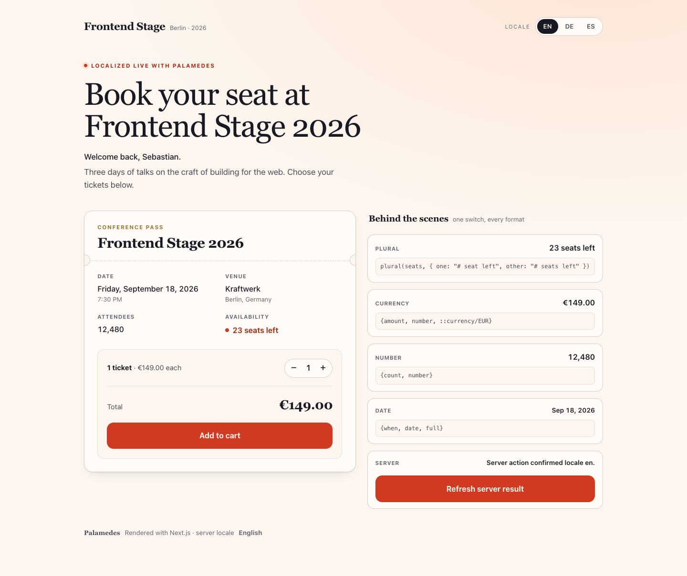
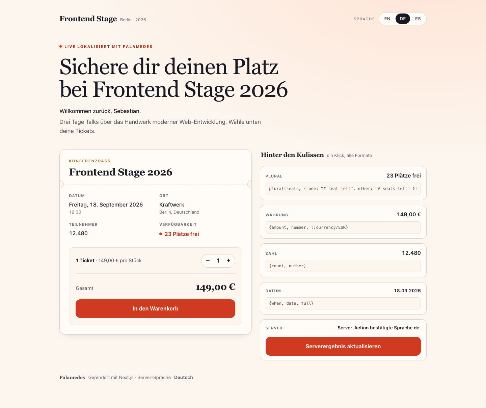
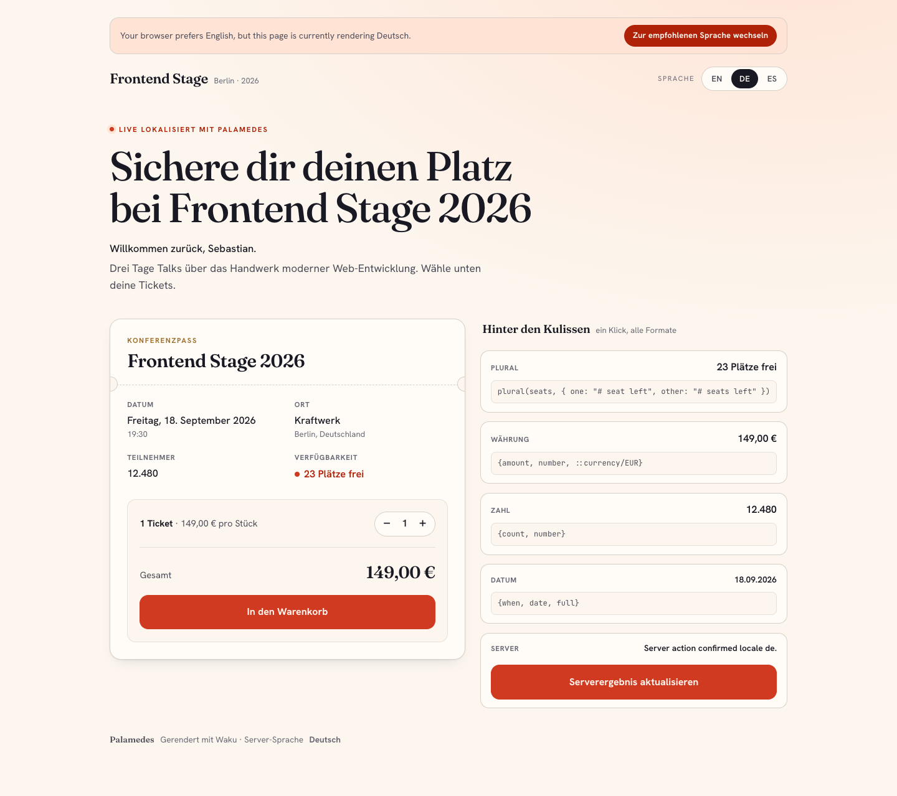
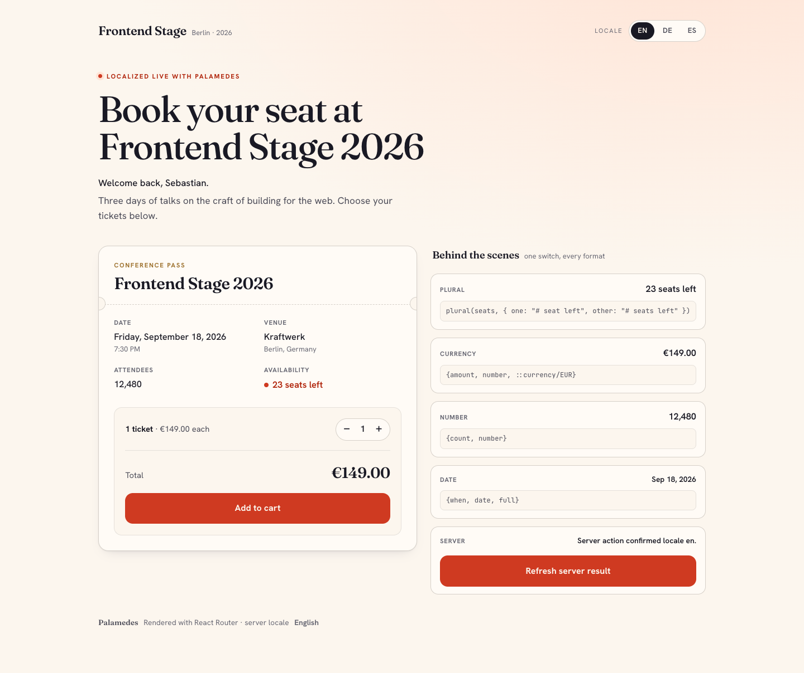
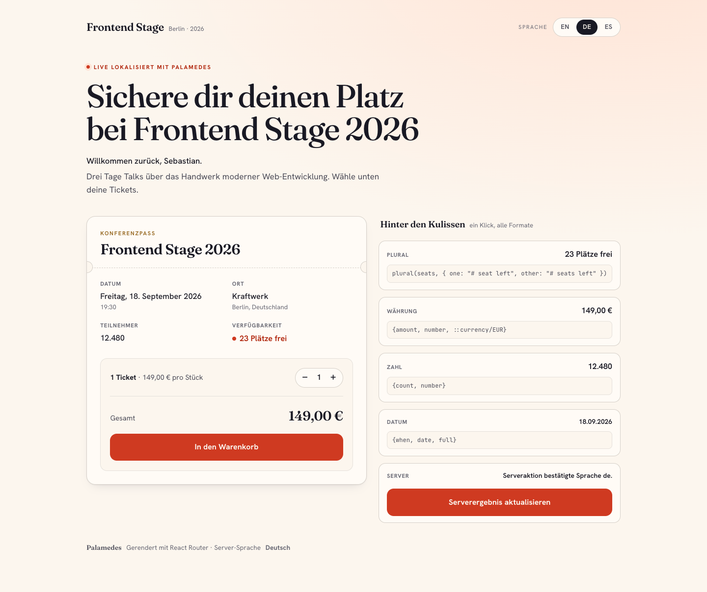
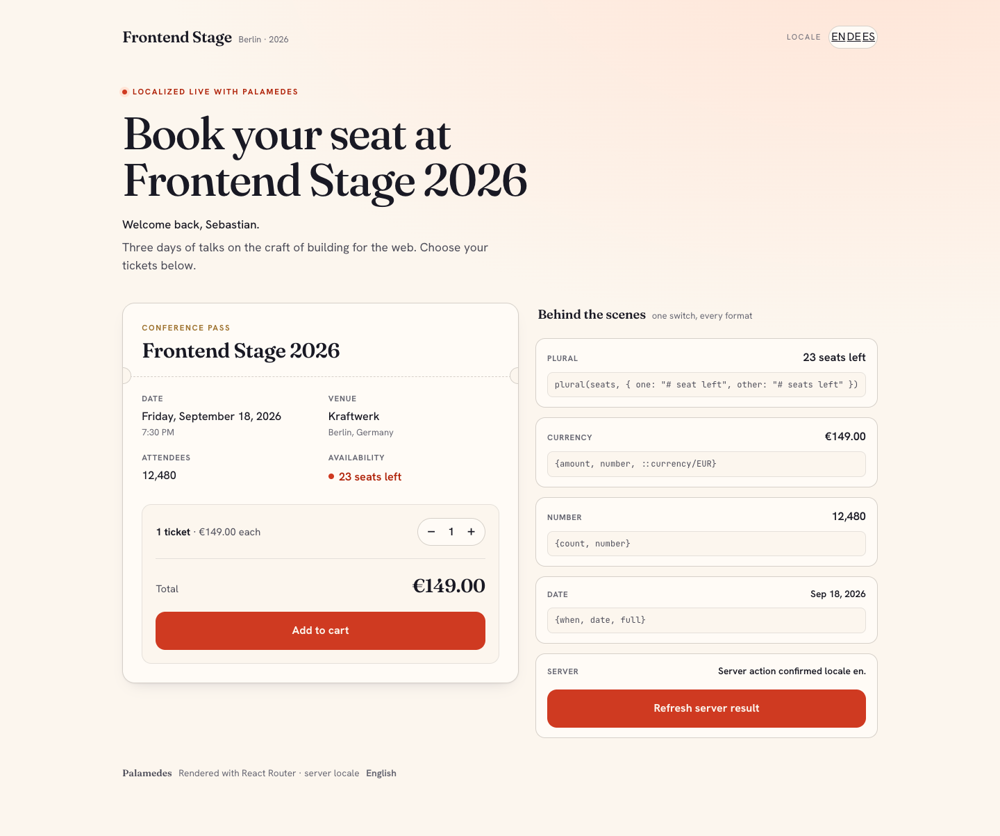
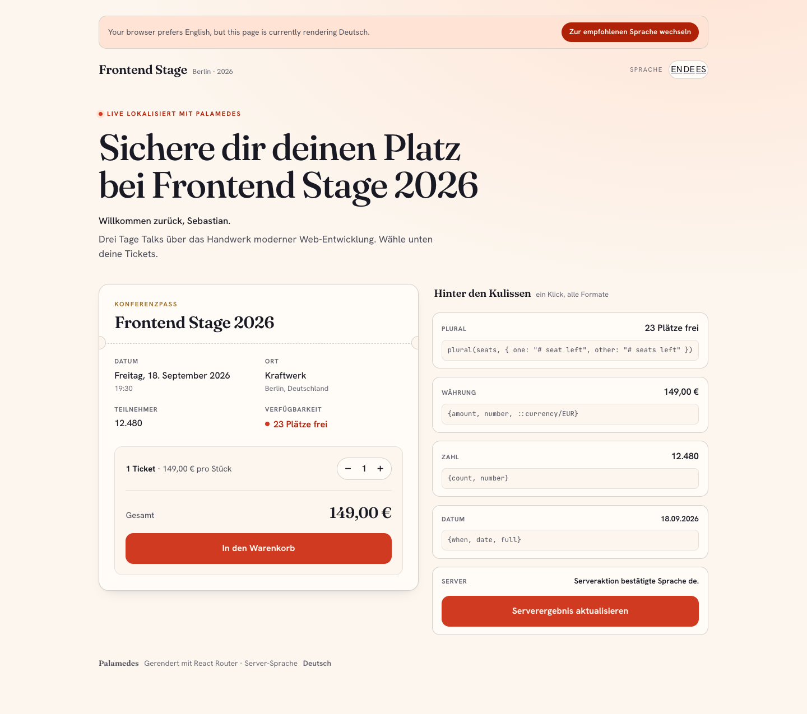

# Example Screenshots

These screenshots are generated from the same Playwright-based browser verifier
used by the example matrix. They are versioned verification artifacts, not
manually curated mockups.

Refresh them with:

```bash
pnpm capture:example-screenshots
```

Each example has two screenshots:

- **Initial**: initial SSR-visible state
- **Interactive**: post-interaction state after locale switching and the localized server interaction flow

## Next.js

### Cookie strategy

| Initial | Interactive |
| --- | --- |
|  |  |

### Route strategy

| Initial | Interactive |
| --- | --- |
|  |  |

## TanStack Start

### Cookie strategy

| Initial | Interactive |
| --- | --- |
|  |  |

### Route strategy

| Initial | Interactive |
| --- | --- |
|  |  |

## SolidStart

### Cookie strategy

| Initial | Interactive |
| --- | --- |
|  |  |

### Route strategy

| Initial | Interactive |
| --- | --- |
|  |  |

## Waku

### Cookie strategy

| Initial | Interactive |
| --- | --- |
|  |  |

### Route strategy

| Initial | Interactive |
| --- | --- |
|  |  |

## React Router

### Cookie strategy

| Initial | Interactive |
| --- | --- |
|  |  |

### Route strategy

| Initial | Interactive |
| --- | --- |
|  |  |
