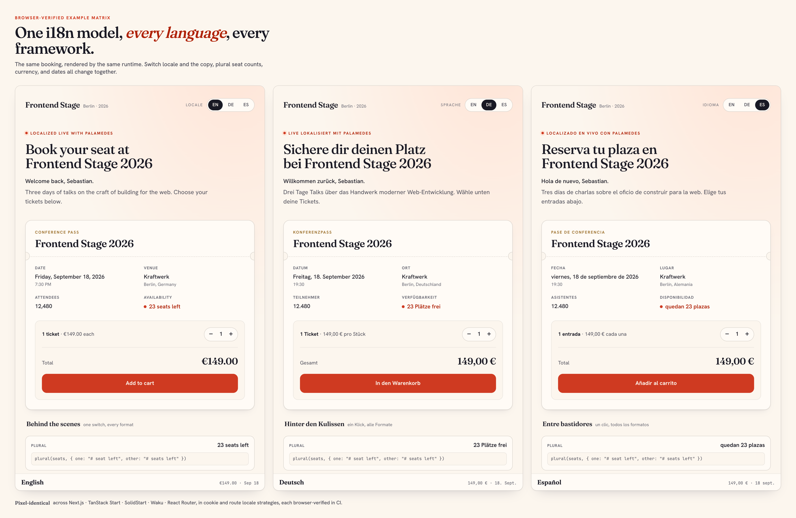

# Palamedes

> Internal messaging note. The published site lives in `site/`; this document
> records homepage positioning language for maintainers.

**Open-source i18n tooling with one coherent model from source to runtime.**

Palamedes is for TypeScript teams that like writing messages close to the code,
want repository-owned source-string-first catalogs, and prefer one explicit
runtime model.

First-party adapters carry that model across verified integrations for Next.js,
TanStack Start, SolidStart, Waku, React Router, Remix v3, and Vite. Backend
servers use the same runtime model but are documented as a guide rather than a
verified matrix family. The matrix proves architectural coherence across
different app shapes; it does not define the product as a tool only for
multi-framework codebases.

We are not asking you to trust a slogan. The repo shows the work.

## Proof First

The strongest public claim is simple: Palamedes keeps the same i18n model
working across different app shapes.

The repo backs that claim with visible evidence:

- six framework families: Next.js, TanStack Start, SolidStart, Waku, React Router, and Remix v3
- four locale strategies per framework: cookie, route segment, subdomain, and tld
- versioned browser screenshots generated from the same Playwright verifier used in CI
- reproducible benchmark commands for transform, extract, catalog update, artifact compile, and end-to-end extract/update workflows
- opt-in FCL catalog storage for canonical, merge-friendly generated catalogs
- A numbered ADR series that explains the product decisions, including what Palamedes deliberately does not own

Start with the [example matrix](../../examples/README.md), the
[versioned screenshots](../example-screenshots/README.md), and the
[proof and benchmark page](../proof-and-benchmarks.md). If you want the
decision trail, read the [ADRs](../../adr/001-project-scope-and-positioning.md).

## Who Builds This

Palamedes is maintained by Sebastian Software GmbH. Sebastian Werner's public
profile lists recent frontend internationalization work for Regrello, including
a Lingui-based application internationalization project from October 2024 to
September 2025. Salesforce later announced the Regrello acquisition and noted
that it completed on October 1, 2025.

The useful signal is continuity: Palamedes comes from repeated work on
source-string-first i18n systems, from older gettext-style macro models to
recent enterprise Lingui migrations. The same lessons show up here as
source-string-first catalogs, `message + context` identity, and ADRs that make
tradeoffs readable before a team depends on the tool.

Evidence:

- [Sebastian Werner profile at Sebastian Software](https://sebastian-software.de/werner)
- [Sebastian Consulting profile](https://sebastian-consulting.de/de/werner)
- [qooxdoo](https://qooxdoo.org/)
- [Salesforce announcement for Regrello](https://www.salesforce.com/news/stories/salesforce-signs-definitive-agreement-to-acquire-regrello/)

## Why It Feels Different

Most i18n tools eventually make teams choose between:

- convenience in one framework
- broad compatibility with a lot of older surface area
- runtime dictionary workflows that move messages away from the source

Palamedes keeps the day-to-day model simpler:

- write messages where the UI happens
- identify messages with `message + context`
- resolve the active runtime through `getI18n()`
- let `ferrocat` own catalog parsing, updates, audits, and ICU diagnostics
- choose PO by default or opt into FCL when a repo needs canonical generated catalog storage
- keep framework adapters thin

Rust matters here because the careful work has one clear home. That keeps the
app-level experience calm.

## Why Teams Care

A coherent local model matters because teams should not have to reopen message
identity, catalogs, and runtime access whenever the application shape changes.

When the runtime model, message identity, and catalog workflow stay stable:

- architecture cleanup gets easier
- migrations carry less conceptual overhead
- performance work lands in one native core instead of several adapter layers
- future translation workflows can build on local catalogs your team still owns

## Palamedes And Palamedes+

Palamedes covers the open-source local workflow for authoring, transformation,
extraction, catalogs, validation, semantic merging, compilation, and runtime
integration. Palamedes+ is planned as an optional managed layer for translation
automation and collaboration.

Palamedes does not require Palamedes+. The local toolchain remains useful on
its own, needs no account, and keeps catalogs in the repository.

## Evidence Behind The Positioning

Palamedes makes specific claims, and the repo shows the work behind them.

Current evidence assets:

- verified example matrix across six framework families
- four locale strategies per framework
- browser screenshots generated from the same Playwright-based verifier used in CI
- benchmark fixtures and documented methodology
- checked end-to-end workflow reports against Lingui and i18next-parser
- structured catalog audits and ICU metadata validation
- architecture and ADR docs that explain the underlying decisions

Useful evidence links:

- [Example matrix](../../examples/README.md)
- [Example screenshots](../example-screenshots/README.md)
- [Proof and benchmarks](../proof-and-benchmarks.md)
- [End-to-end workflow benchmark](../benchmark-e2e-workflow.md)
- [Framework notes](../framework-example-notes.md)
- [Round 1 posts](./posts/README.md)

## Competitive Frame

The cleanest direct comparison is still Lingui: similar authoring feel, with a
stricter end state underneath.

The broader market picture matters too:

- Lingui is the closest authoring-model neighbor
- `next-intl` is stronger when a team wants a Next.js-native message-file center
- General Translation solves a broader translation-system problem

Palamedes combines broad local workflow coverage with an opinionated model:
compile-time authoring, source-string-first semantics, catalog validation and
merging, and runtime integration connected to supported hosts through
first-party adapters.

## Start Here

- [First working translation in 5 minutes](../first-working-translation.md)
- [Proof and benchmarks](../proof-and-benchmarks.md)
- [End-to-end workflow benchmark](../benchmark-e2e-workflow.md)
- [Comparison with Lingui](../comparison-with-lingui.md)
- [Comparing modern i18n approaches](../approach-comparison.md)
